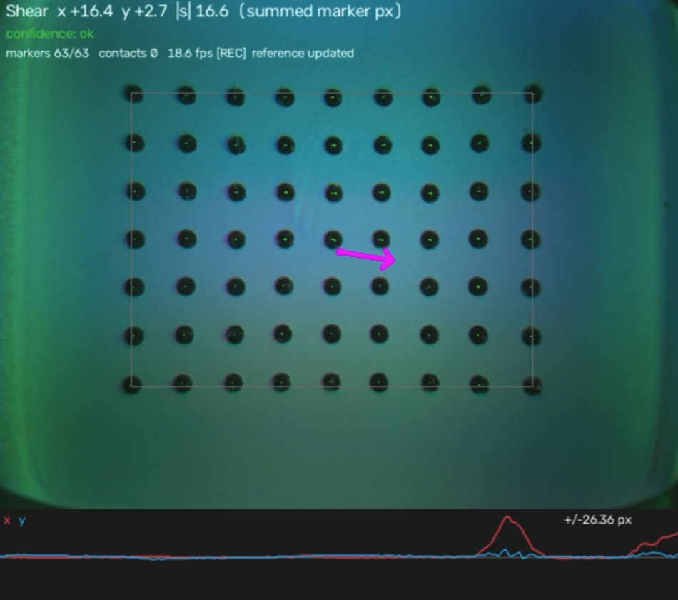

# gelshear: a quick plug and play project on net 2-D shear from a marker GelSight

Extracts net tangential (x-y) shear from marker motion, with the normal-load
contribution cancelled by symmetry rather than by calibration.

**Idea (dot pairing).** In 1-D, two dots symmetric about a press move in
opposite directions under normal load (net zero) and together under shear
(net = shear). The 2-D version pairs each point p with its mirror 2c - p through
the contact centre c: radial (normal) and rotational (torsion) motion cancels,
shear adds. The algorithm:

1. Track dots; interpolate their displacement onto a uniform grid (normalisation:
   every point gets an exact mirror partner and equal area weight, wherever c is).
2. Find contact centres from the shading image.
3. Drop grid points whose mirror partner falls outside the window
   ("only count dots that have a partner"). Interior contacts lose nothing.
4. Sum the remaining field: normal load cancels for every contact at once.
5. Subtract the perspective leak (self-calibrated from straight presses) and tare.
For a thin gel bonded to acrylic the scale is exact in linear elasticity:
`F_t = (G/h) * integral(u dA)`, with `G ~ E/3`.



## Setup

```
pip install -r requirements.txt
python synthetic_test.py          # hardware-free check of the full pipeline
python run_live.py --source 0     # camera index of your GelSight
```

Keep the gel untouched at startup: the first frames become the no-contact reference.

## Keys

| key | action |
|---|---|
| `r` | re-capture reference (gel untouched) |
| `z` | tare: zero the current reading |
| `c` | start/stop perspective calibration (pure normal presses only) |
| `f` | fit perspective correction, save to `config.json` |
| `s` | start/stop recording per-frame data to `rec_*.npz` |
| `d` | debug view: shading-change map (white = counted as contact) |
| `q` | quit |

## What's on screen

- Green arrows: per-marker displacement (scaled). Red dots: markers lost this frame.
- Cross, circle, arrow: each contact, its symmetric pairing disk, and its own shear.
  Blue = interior, orange = near edge (corrected), red = too many unpaired dots.
- Small red points: grid points dropped because their mirror partner is outside the window.
- Magenta arrow + top readout: net shear, in summed marker displacement (px).
  Confidence: `ok`, `edge-corrected` (direction good, magnitude somewhat low),
  `unreliable` (contact mostly off the window).
- Bottom strip: history of net x (red) and y (blue). Image coordinates: +y points down.
  Newtons are shown if `marker_pitch_mm`, `gel_thickness_mm`, `youngs_modulus_mpa`
  are set in `config.json` (the E value sets absolute accuracy).

## Test protocol (about 15 minutes)

1. **Pure presses, center.** Press straight down with a fingertip or rounded object.
   The net arrow should stay near zero while the markers spread visibly.
2. **Perspective calibration.** Press `c`, then do straight presses at many positions,
   especially away from the image center. Press `c` to stop, `f` to fit.
   Repeat step 1 off-center: residual drift toward/away from the image center should shrink.
3. **Two-finger press.** Two simultaneous straight presses: still near zero.
4. **Shear.** Press, then drag sideways without slipping: the arrow should follow
   the drag direction and grow with drag distance, largely independent of press depth.
5. **Depth independence.** Same sideways drag at shallow vs deep press. Similar arrow
   length means low Fz coupling; a systematic difference is the nonlinear coupling
   linear theory can't remove.
6. **Edge.** Press straight near the window edge: red points appear and the arrow should
   stay small. Drag near the edge: direction should be right, magnitude a bit low.

Record any of these with `s` for offline analysis (tracked marker positions plus
`S_all`, `S_paired`, `S_corrected`, `net_px`, confidence, contact count per frame).

## Outputs per frame

- `S_all`: sum over every grid point (no edge pairing), for comparison.
- `S_paired`: sum over paired points only (main estimate before corrections).
- `S_corrected` / `net_px`: minus perspective leak and tare (what's displayed);
  `net_px` is in summed-marker-displacement units.
- Per contact: shear from the largest symmetric disk around it (shown as its arrow).

## If confidence turns "unreliable" over time

The label now shows the reason. Usual causes and fixes:

- **Lighting/exposure drift** (most common): the camera's auto-exposure or white balance,
  or LEDs warming up, slowly changes the shading, especially at the edges, until it
  looks like a contact. Press `d`: white blobs where nothing touches the gel confirm it.
  - Quick fix: lift off and press `r` to re-capture the reference.
  - Automatic: `auto_rebaseline` (on by default) slowly updates the baseline and the
    shear zero whenever the markers show the gel is untouched.
  - Root fix: lock exposure and white balance, e.g. on Linux
    `v4l2-ctl -d /dev/video0 -c auto_exposure=1 -c white_balance_automatic=0`
    (control names vary by camera; `v4l2-ctl -d /dev/video0 -l` lists them),
    and let the sensor warm up a few minutes before capturing the reference.
- **Markers lost** ("only N% markers tracked"): a fast motion or hard press broke tracking.
  Lift off and press `r`.
- **Contact near window edge**: a real edge contact; nothing to reset.

Auto re-baselining only runs when the markers are nearly at rest (`idle_disp_px`), so it
won't erase a held press or shear. A very slow constant shear could still be partly
tared away; set `auto_rebaseline` to false for long static-hold experiments.

## Tuning (`config.json`)

- Few markers detected: adjust `blackhat_ksize` (must exceed the dot diameter) or `width`.
- Dark rim or vignetting: set `crop_frac` (e.g. 0.05-0.15).
- Contacts missed or spurious: `contact_thresh`, `min_contact_area_px`.
- Markers lost during fast motion: raise `match_gate_frac` (< 0.5 to avoid swaps) or move slower.
- Edge handling too eager/lax: `influence_margin_frac` (roughly a few gel thicknesses, in pitches),
  `unreliable_unpaired_frac`.

## Known limits

- Edge contacts: pairing removes most normal leakage, but dropped dots also carried
  shear, so magnitude reads low; contacts mostly off the window are flagged unreliable.
- Gross slip and large indentation break linearity; check with step 5.
- Slow drift (temperature, gel creep): re-tare with `z` or re-reference with `r`.
- Tracking is nearest-neighbour from the previous frame; very fast jumps beyond the
  gate lose markers until they're re-acquired.
